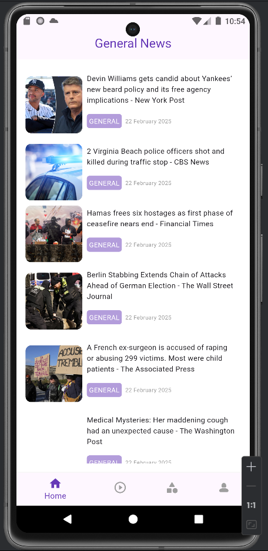
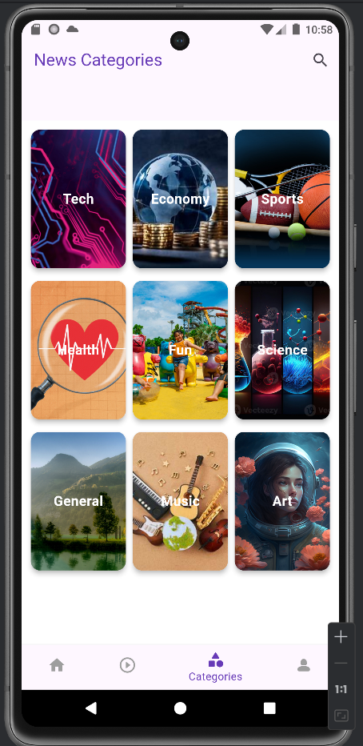
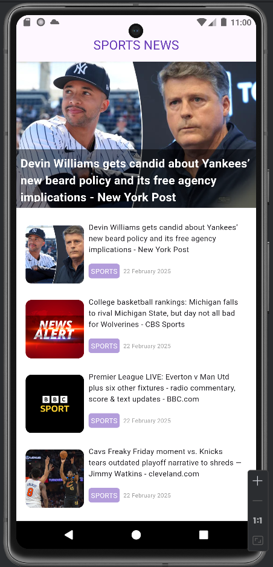
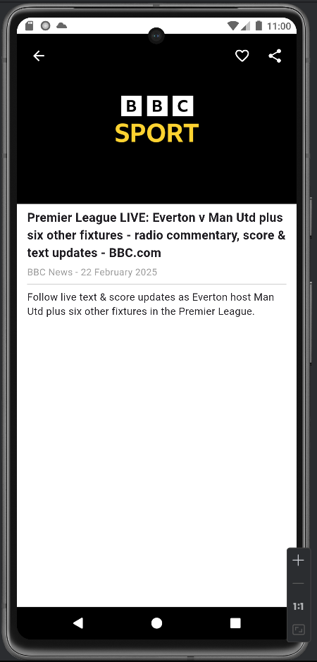
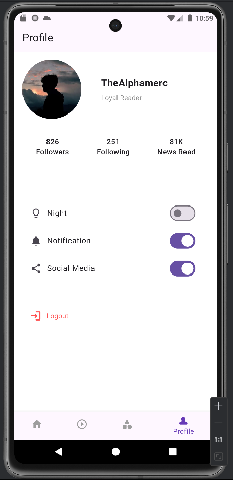

# News Explorer

A modern Flutter-based news application that fetches and displays news articles from the NewsAPI. The app features categories, a profile with theme switching, and detailed news views, all managed with the BLoC state management pattern for a robust and scalable architecture.

## Features
- Browse top headlines and category-specific news
- View detailed articles with images and descriptions
- Switch between light and dark themes
- Search and filter news categories
- Profile page with user stats and settings
- Video news placeholder (requires additional API integration)

## Project Structure
The project follows a clean architecture with BLoC for state management. Here’s an overview:

news_explorer/     
├── lib/  
│   ├── blocs/  
│   │   ├── news_bloc.dart      
│   │   ├── news_event.dart     
│   │   └── news_state.dart     
│   ├── models/                 
│   │   └── article.dart        
│   ├── screens/     
│   │   ├── home.dart  
│   │   ├── home_screen.dart    
│   │   ├── category_screen.dart  
│   │   ├── news_details_screen.dart  
│   │   ├── profile_screen.dart  
│   │   └── video_screen.dart    
│   ├── services/                
│   │   └── news_services.dart   
│   ├── theme/                   
│   │   └── app_theme.dart       
│   ├── widgets/                 
│   │   └── news_card.dart       
│   └── main.dart                
├── assets/                     
├── pubspec.yaml               
└── README.md

- **blocs/**: Contains BLoC-related files for managing news fetching states.
- **models/**: Defines the `Article` class for parsing API responses.
- **screens/**: Houses all main UI screens, each connected to the BLoC.
- **services/**: Handles API calls to NewsAPI.
- **theme/**: Manages app theming with light and dark modes.
- **widgets/**: Reusable components like the `NewsCard`.

## Screenshots

Below are some key screens from the app:

- **Home Screen**: Displays top headlines.

  

- **Category Screen**: Browse news by category.

  

- **Category News**: News of a particular category.

  

- **News Detail**: Full article view.

  

- **Profile**: User settings and theme toggle.

  